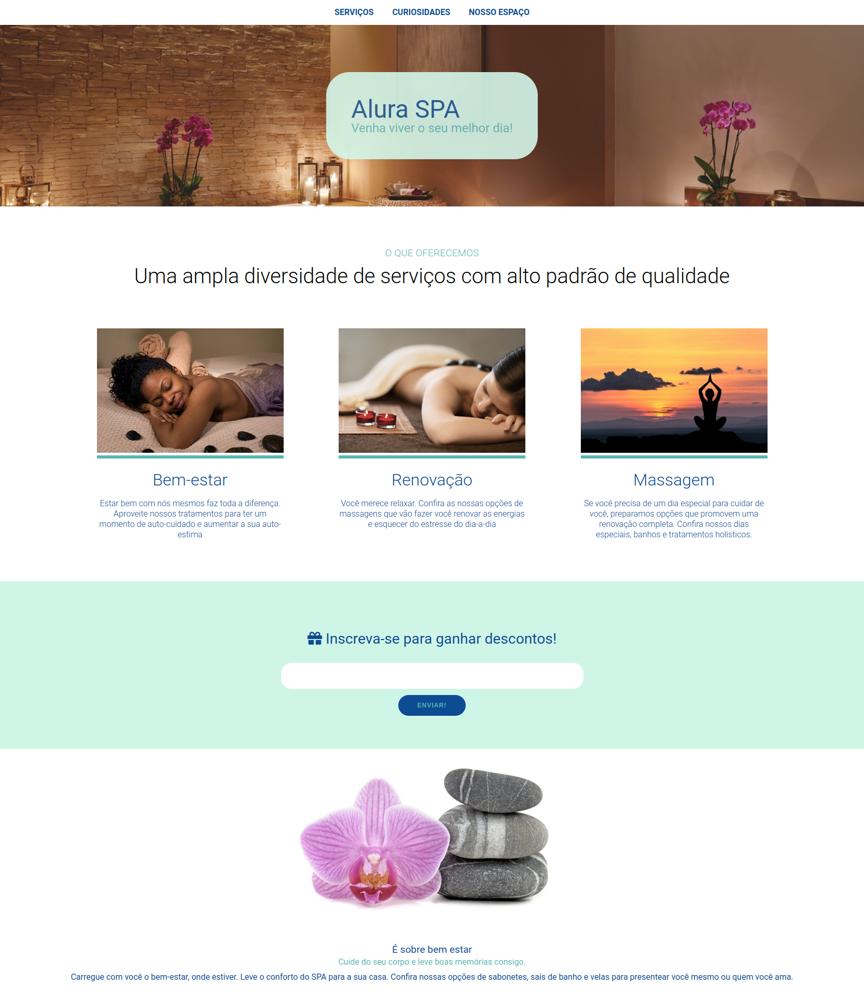

<h1 align="center">Alura SPA </h1>

Projeto de site sobre um salão de SPA!
 

  <h2>🏠 Home </h2>
  

## 🚀 Tecnologias

Esse projeto foi desenvolvido com as seguintes tecnologias:

-  HTML
-  SCSS
-  CSS
-  Git e Github
-  Vercel

## 🖱 Página publicada

-  https://matheussantos10.github.io/alura-spa/
-  https://alura-spa-ruby.vercel.app/
